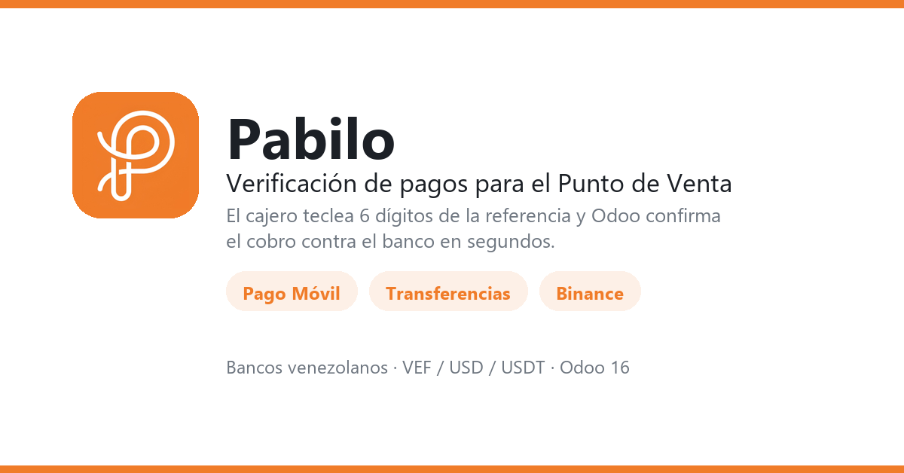

# Pabilo Payment Gateway for Odoo

[](https://github.com/AndrusGerman/pabilo-payment-gateway-for-odoo/tree/16.0)
[](https://github.com/AndrusGerman/pabilo-payment-gateway-for-odoo/tree/17.0)

[](CHANGELOG.md)

Verificación automática de pagos venezolanos dentro del Punto de Venta de Odoo.



El cajero teclea los **últimos 6 dígitos** de la referencia, confirma la fecha
—ya rellenada con hoy— y Odoo verifica el cobro contra el banco a través de la
API de [Pabilo](https://pabilo.app), sin salir de la pantalla de pago. El mismo
método sirve para **pago móvil, transferencias y Binance**.

El navegador nunca ve el `appKey`: el JS del POS llama a Odoo por RPC y es el
servidor quien habla con Pabilo.

## Series soportadas

No hay rama `main`. Una rama por serie, nombrada igual que la versión de Odoo,
siguiendo la convención de `odoo/odoo` y la OCA. El código es específico de cada
serie: el JS del POS de 16 y 17 no comparte una línea.

| Serie | Rama | Versión | Bundle de assets | Módulos JS |
| :--- | :--- | :--- | :--- | :--- |
| Odoo 16.0 | [`16.0`](https://github.com/AndrusGerman/pabilo-payment-gateway-for-odoo/tree/16.0) | `16.0.2.0.0` | `point_of_sale.assets` | `odoo.define` |
| Odoo 17.0 | [`17.0`](https://github.com/AndrusGerman/pabilo-payment-gateway-for-odoo/tree/17.0) | `17.0.2.0.0` | `point_of_sale._assets_pos` | ESM (`@odoo-module`) |

Los tres últimos números de la versión van iguales en ambas ramas, así que
`2.0.0` significa lo mismo en las dos.

## Instalación

Descarga el paquete de tu serie desde
[Releases](https://github.com/AndrusGerman/pabilo-payment-gateway-for-odoo/releases)
o clona la rama correspondiente:

```bash
# El addon debe quedar dentro del addons_path de Odoo
cp -r pabilo_payment_gateway /mnt/extra-addons/
odoo -u pabilo_payment_gateway -d <db> --stop-after-init
```

## Configuración

1. **Ajustes → Pabilo**: pega el API Key (`appKey`) y pulsa **Sincronizar Cuentas**.
2. **Punto de Venta → Pabilo → Agregar Método de Pago**: elige la cuenta bancaria
   y guarda.
3. Añade el método de pago al punto de venta.

La URL base del backend vive en el parámetro de sistema `pabilo.api_url`
(por defecto `https://api.pabilo.app`).

## Características

- Método de pago del POS que verifica contra la API de Pabilo en tiempo real.
- Pago móvil, transferencias y Binance con el mismo método.
- **Multi-moneda**: si el POS cobra en dólares y el banco registra en bolívares,
  el monto se convierte con las tasas nativas de Odoo antes de consultar. Sin tasa
  cargada el cajero ve un error claro, en vez de un "monto no coincide"
  incomprensible.
- **El cajero elige cómo se valida**: aceptar la tasa de Odoo, usar otra tasa o
  escribir el monto exacto del comprobante. Para tiendas con un módulo de moneda
  alterna, se puede apuntar a la tasa de ese módulo desde el método de pago.
- Fecha del pago prellenada con hoy, calculada en la zona local del navegador.
- Rechazo de referencias ya usadas, para no cobrar dos veces el mismo pago.
- Referencia e ID de Pabilo persistidos en `pos.payment` y en el recibo.
- Cuentas bancarias sincronizadas desde Pabilo en **modo solo lectura**, con tres
  capas de protección (ACL, guardas de contexto y vistas).
- Webhook con firma **HMAC-SHA256** verificada con `consteq`, ventana de 5 minutos
  contra repetición, y rechazo total si no hay secreto configurado.
- Sin reintentos: un fallo de verificación es definitivo porque el backend ya
  consultó el banco. Una sola llamada con 110 s de timeout.

## Documentación

| Documento | Contenido |
| :--- | :--- |
| [Manual del addon](pabilo_payment_gateway/README.md) | Arquitectura, contrato con el backend, webhook y limitaciones conocidas. |
| [VERSIONES.md](VERSIONES.md) | Diferencias entre series y procedimiento de pruebas. |
| [CHANGELOG.md](CHANGELOG.md) | Historial de cambios. |
| [RELEASE.md](RELEASE.md) | Modelo de ramas, numeración y publicación en el Apps Store. |

## Equipo

| | Rol |
| :--- | :--- |
| **[@AndrusGerman](https://github.com/AndrusGerman)** | Autor y mantenedor |
| **[@dasilvacsv](https://github.com/dasilvacsv)** | Revisión de código y QA |

Los créditos completos están en [AUTHORS.md](AUTHORS.md).

## Licencia

**OPL-1** (Odoo Proprietary License v1.0), la licencia de Odoo para módulos de
pago. El módulo se vende en el Apps Store a **25 USD**. Requiere una cuenta en
[pabilo.app](https://pabilo.app) con su API Key.
